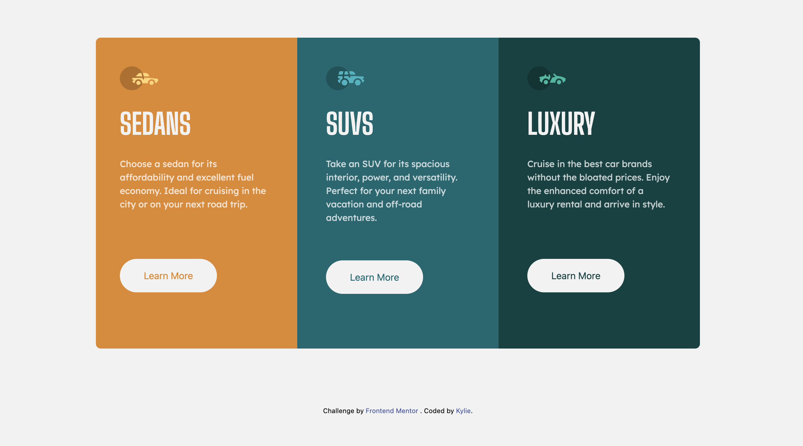

# Frontend Mentor - 3-column preview card component solution

This is a solution to the [3-column preview card component challenge on Frontend Mentor](https://www.frontendmentor.io/challenges/3column-preview-card-component-pH92eAR2-). Frontend Mentor challenges help you improve your coding skills by building realistic projects. 

## Table of contents

- [Overview](#overview)
  - [Screenshot](#screenshot)
  - [Links](#links)
- [My process](#my-process)
  - [Built with](#built-with)

## Overview
### Screenshot

### Links
- Live Site URL: [https://kylie-kiaying.github.io/3-column-preview-frontend-mentor/](https://kylie-kiaying.github.io/3-column-preview-frontend-mentor/)

### Built with
- Semantic HTML5 markup
- Tailwind CSS
- Mobile-first workflow

## Author
- Frontend Mentor - [@kylie-kiaying](https://www.frontendmentor.io/profile/kylie-kiaying)
